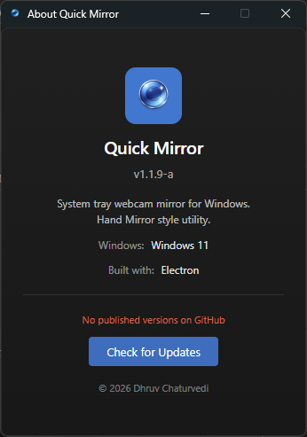

# Quick Mirror

**Instant webcam mirror from the system tray — because yes, you *could* open Camera app like a normal person... but that is not power-user behavior.**

Runs in the tray only (no taskbar icon, no ceremony). Left-click for quick mirror checks. Right-click for fullscreen, settings, and advanced tinkering.


---

## Features

- **🧩 Tray-only** — Lives in the system tray like a sneaky little utility gremlin
- **🪞 Mini mirror** — Floating popup mirror (320×240 default), mirrored video, auto-closes when you click away like it pays rent
- **🖥️ Fullscreen mirror** — Full-screen face inspection mode; smash **ESC** to leave your villain arc
- **⚙️ Settings** — Camera, resolution, FPS, mirror mode, popup behavior, startup, hotkey, frame fit mode
- **🚀 Single instance** — No duplicate app armies; commands reuse the same running process
- **💾 Persistent settings** — Your preferences survive restarts, updates, and 2 AM config decisions

---

## Requirements

- **🪟 Windows 10 or 11**
- **📷 A webcam**
- **🟢 Node.js 18+** (only for building/development)

---

## Installation & run (development)

```bash
# Clone the repo (if needed)
git clone https://github.com/dhruvcx-1/webcamquickmirror.git
cd webcamquickmirror

# Install dependencies
npm install

# Run the app
npm start
```

The app starts in the tray. Click icon, inspect vibes, proceed with confidence. ✨

---

## Usage

| Action | Result |
|--------|--------|
| **🖱️ Left-click** tray icon | Open mini mirror popup |
| **🖱️ Right-click** tray icon | Menu: Open Mirror, Open Fullscreen Mirror, Settings, Exit |
| **👆 Click outside** popup | Close popup |
| **⌨️ ESC** (in fullscreen) | Close fullscreen mirror |
| **⚙️ Settings** (tray or fullscreen gear) | Open settings window |

---

## Settings

Open **Settings** from tray menu (or fullscreen gear) and tune everything until it feels illegally smooth.

| Section | Options |
|--------|--------|
| **📷 Camera** | Choose webcam (updates when devices are plugged/unplugged) |
| **🎞️ Quality** | Resolution (Low / Medium / High / Ultra) and frame rate (30 or 60 FPS) |
| **🧠 Behavior** | Mirror video on/off, Always on top |
| **⚡ Startup** | Launch at startup, Start minimized to tray |
| **📐 Popup** | Popup size: Small, Medium, Large |
| **⌨️ Advanced** | Global hotkey to open the mirror (click field, then press your combo) |

Settings save instantly and apply right away. No Save button. No trust falls.

---

## Build (Windows installer & portable)

```bash
npm install
npm run build
```

Output in the **`dist/`** folder:

- **🟦 Quick-Mirror-Setup-x.x.x.exe** — NSIS installer (**recommended**)
- **🧳 Quick-Mirror-x.x.x.exe** — Portable (no install, **no auto-updates**)

Use the installer unless you have a very specific reason not to. It supports in-app updates and smoother upgrades. This is the sane default. ✅

Optional: add **`assets/icon.ico`** for the app icon and **`assets/tray-icon.png`** (16×16 or 32×32) for the tray icon.

---

## Command line

When the app is built, you can use:

| Command | Description |
|--------|-------------|
| `Quick Mirror.exe` | Start app in tray |
| `Quick Mirror.exe --fullscreen` | Start and open fullscreen mirror (or focus it if already running) |
| `Quick Mirror.exe --popup` | Start and open the mini mirror popup |
| `Quick Mirror.exe --quit` | Exit the running app |

Only one instance runs. Run `Quick Mirror.exe --fullscreen` again and it just focuses the existing app. Zero clone wars.

---

## Releases

**⬇️ Download the latest release (installer or portable):**  
**[Releases](https://github.com/dhruvcx-1/webcamquickmirror/releases)**

Each release includes:
- **🟦 Quick-Mirror-Setup-x.x.x.exe** — Installer (**recommended**)
- **🧳 Quick-Mirror-x.x.x.exe** — Portable, no install

Important:
- ❌ Portable builds do **not** support auto-updates.
- ✅ In-app updater works only with installer-based builds.

TL;DR: if you want the easy life, grab the installer. Portable is for people who enjoy doing things manually on purpose.

---

## Previews

### ✨ Tray Popup


### ⚙️ Settings


### 🔄 About & Updates


---

## About

Yes, I made an app to look at my own face. On purpose. With effort. With architecture.

And yes, I know the Windows Camera app exists. Everyone knows it exists. That is not the point.

The point is: if I need to check hair, lighting, posture, beard alignment, hoodie symmetry, or just confirm I still look like a functioning member of society, I do not want to launch a full app, wait, click around, and pretend this is a normal workflow.

I want a hotkey. I want instant mirror. I want out.

Call it efficiency. Call it vanity. Call it a productivity-adjacent personality disorder. I call it ergonomics.

So yes — this is a purpose-built tray gremlin for rapidly summoning my own face at will. If that sounds unhinged, correct. If it sounds useful, also correct.

Also yes, real mirrors exist. Revolutionary concept.

I could stand up and walk to one like it's 1890.
I could use the front camera on my phone like a civilian.
I could probably see my reflection in a spoon, a glossy monitor bezel, a window at night, or the surface tension of a very committed glass of water.

But here's the problem: all of those require effort, movement, or emotional resilience.

Some people keep a mirror on their desk. Respect. That's elite preparation.
Some of us keep keyboard shortcuts and mild delusion.

If laziness had a software architecture diagram, this app is the final form:
tray icon + hotkey + instant face + disappear like nothing happened.

No startup ritual. No app hunting. No "wait why is this opening in full camera mode" nonsense.

Just:
- press hotkey
- evaluate face
- continue mission

Also yes, I built a full auto-updater for an app that started as "personal use only". At some point ADHD hyperfixation took the wheel, and now I am out here making 39 commits at 4 AM because a scrollbar looked 2 pixels wrong. And guess what it still does.

Built as a personal side project for daily use, with a tiny AI assist and mostly stubborn human effort. If you find bugs, weird edge cases, or cursed behavior, open an issue and I will absolutely look at it. 🙌

---
