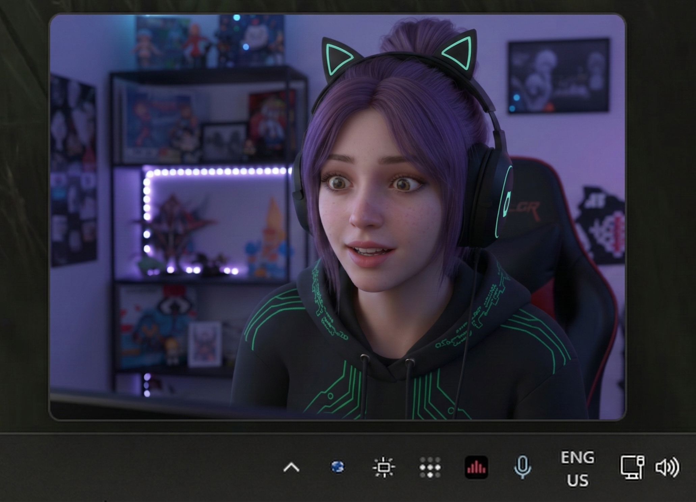
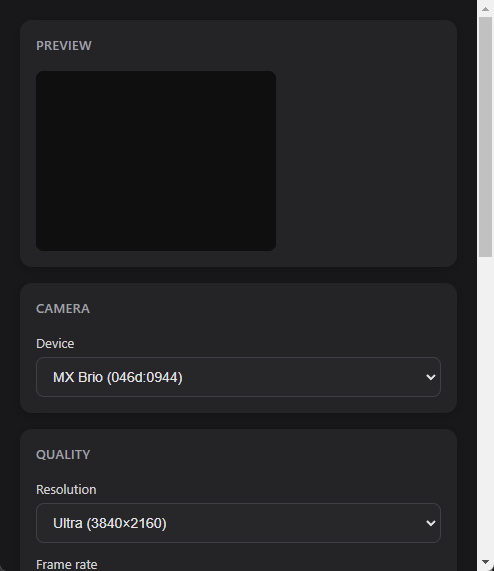
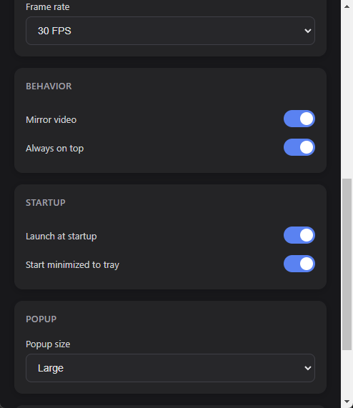
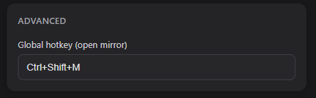
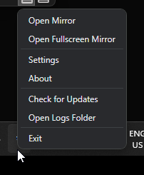

# Quick Mirror

**Instant webcam mirror from the system tray — Hand Mirror style for Windows.**

Runs in the tray only (no taskbar icon). Left-click for a small mirror popup; right-click for fullscreen, settings, or exit.



---

## Features

- **Tray-only** — Lives in the system tray, no taskbar clutter
- **Mini mirror** — Small floating popup (320×240 default), mirrored video, closes when you click outside
- **Fullscreen mirror** — Full-screen view; press **ESC** to close
- **Settings** — Camera, resolution, FPS, mirror on/off, popup size, always on top, launch at startup, global hotkey (default **Ctrl+Shift+M**)
- **Single instance** — One process; `QuickMirror.exe --fullscreen` opens fullscreen in the running app
- **Persistent settings** — Stored locally and applied immediately

---

## Requirements

- **Windows 10 or 11**
- A webcam
- **Node.js 18+** (only for building/development)

---

## Installation & run (development)

```bash
# Clone the repo (if needed)
git clone https://github.com/dhruvcx-1/webcamquickmirror.git
cd webcamquickmirror

# Install dependencies
npm install

# Run the app
npm start
```

The app starts in the system tray. Use the tray icon to open the mirror or settings.

---

## Usage

| Action | Result |
|--------|--------|
| **Left-click** tray icon | Open mini mirror popup |
| **Right-click** tray icon | Menu: Open Mirror, Open Fullscreen Mirror, Settings, Exit |
| **Click outside** popup | Close popup |
| **ESC** (in fullscreen) | Close fullscreen mirror |
| **Settings** (tray or fullscreen gear) | Open settings window |

---

## Settings

Open **Settings** from the tray menu or the gear icon in fullscreen.

| Section | Options |
|--------|--------|
| **Camera** | Choose webcam (updates when devices are plugged/unplugged) |
| **Quality** | Resolution (Low / Medium / High / Ultra) and frame rate (30 or 60 FPS) |
| **Behavior** | Mirror video on/off, Always on top |
| **Startup** | Launch at startup, Start minimized to tray |
| **Popup** | Popup size: Small, Medium, Large |
| **Advanced** | Global hotkey to open the mirror (click field, then press your combo) |

Settings are saved automatically and apply to the popup and fullscreen mirror right away.

---

## Build (Windows installer & portable)

```bash
npm install
npm run build
```

Output in the **`dist/`** folder:

- **Quick Mirror Setup 1.0.0.exe** — NSIS installer
- **Quick Mirror 1.0.0.exe** — Portable (no install)

Optional: add **`assets/icon.ico`** for the app icon and **`assets/tray-icon.png`** (16×16 or 32×32) for the tray icon.

---

## Command line

When the app is built, you can use:

| Command | Description |
|--------|-------------|
| `Quick Mirror.exe` | Start app in tray |
| `Quick Mirror.exe --fullscreen` | Start and open fullscreen mirror (or focus it if already running) |
| `Quick Mirror.exe --popup` | Start and open the mini mirror popup |
| `Quick Mirror.exe --quit` | Exit the running app |

Only one instance runs. Running `Quick Mirror.exe --fullscreen` again while the app is open will open or focus the fullscreen window in the same process.

---

## Releases

**Download the latest release (installer or portable):**  
**[Releases](https://github.com/dhruvcx-1/webcamquickmirror/releases)**

Each release includes:
- **Quick Mirror Setup x.x.x.exe** — Installer (recommended)
- **Quick Mirror x.x.x.exe** — Portable, no install

### Creating a new release

1. Update the version in **`package.json`** (e.g. `"version": "1.0.1"`).
2. Commit, then create and push a tag matching the version:
   ```bash
   git add package.json
   git commit -m "Bump version to 1.0.1"
   git tag v1.0.1
   git push origin main
   git push origin v1.0.1
   ```
3. GitHub Actions will build the app on Windows and create a release with the `.exe` files attached. Check the **Actions** tab, then the **Releases** page once the workflow finishes.

---

## Previews

### Tray Popup


---

### Settings Page
 

---

### Context Menu & Hotkey Setting
 

---
## About

This is a personal side project built with Cursor and some of my own intelligence lol for my own use. I'm not a professional developer, so please excuse any bugs or rough edges. Feel free to report issues or suggest improvements!

